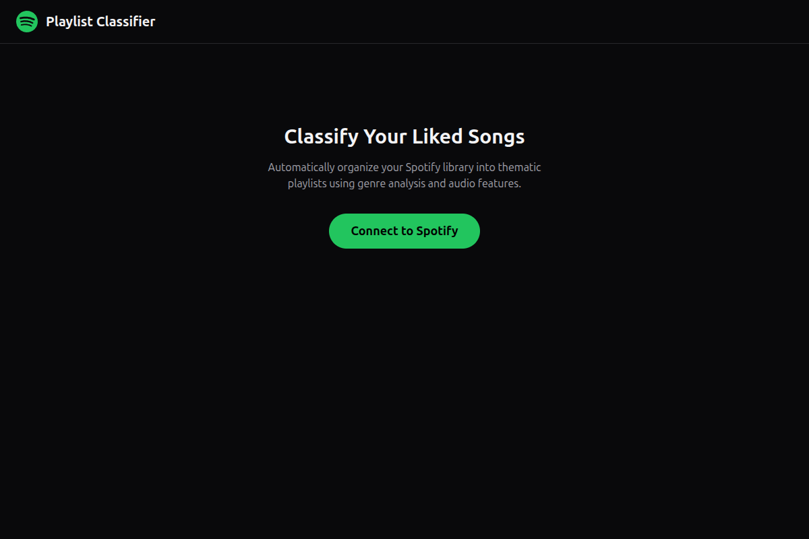
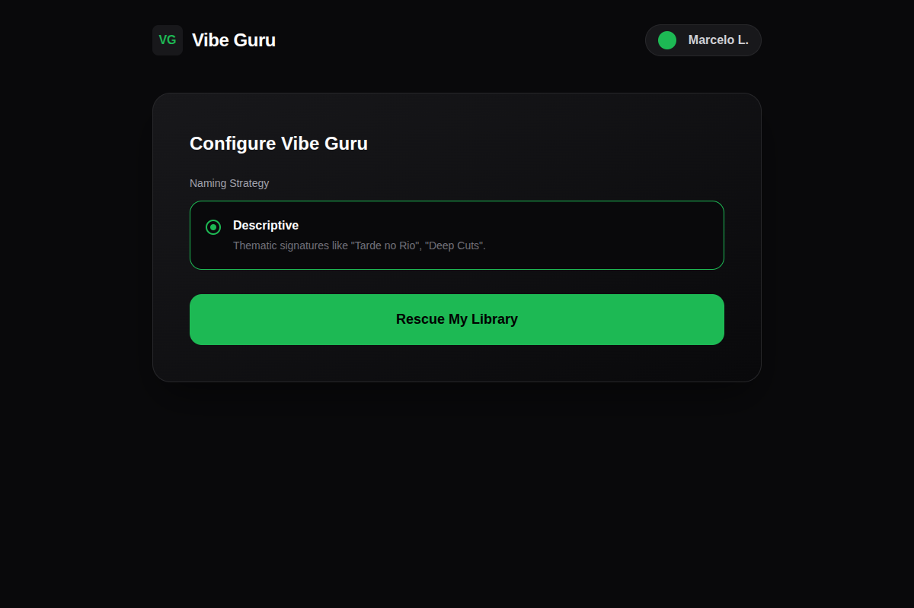
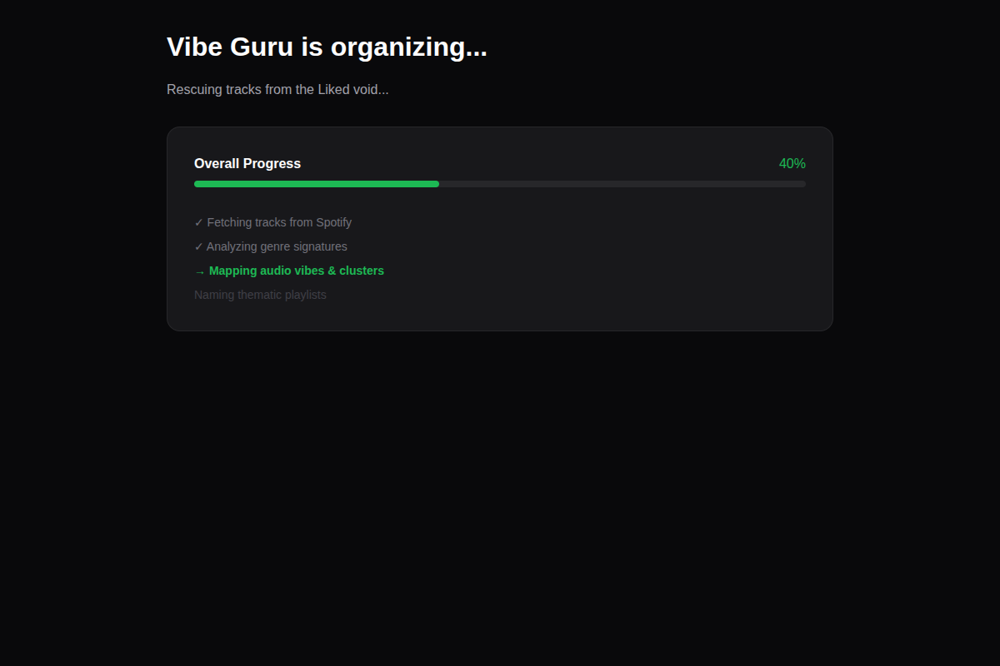
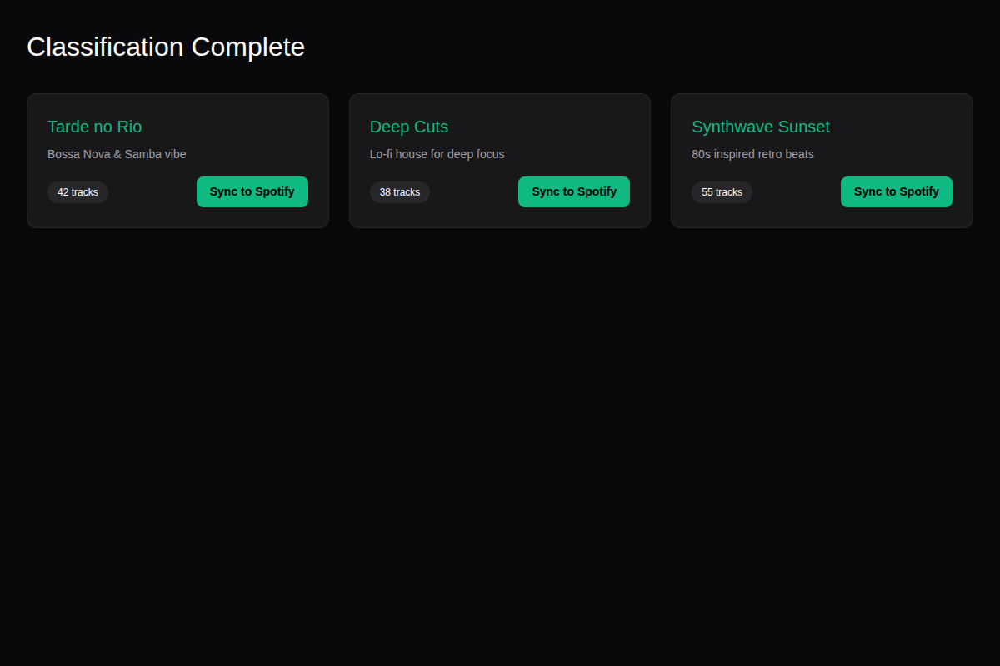
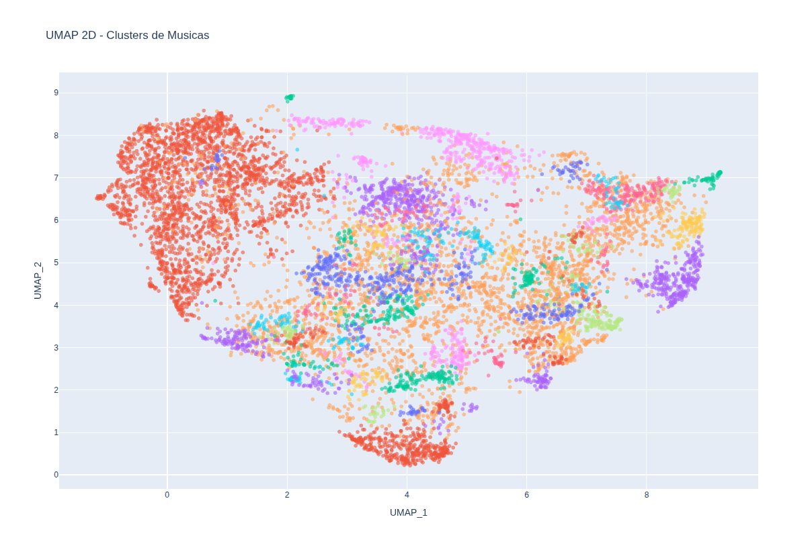
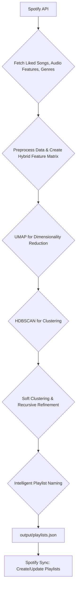

<div align="center">
  
</div>

# Vibe Guru: Your Personal AI-Powered Spotify Playlist Organizer

**Vibe Guru** is a sophisticated, AI-driven tool that automatically organizes your chaotic "Liked Songs" on Spotify into dozens of cohesive, vibe-based playlists. Stop letting your favorite tracks get lost in a massive, unorganized list—let our Spotify AI playlist technology rescue your music library.

## The Problem: The "Liked Songs" Graveyard

Do you have thousands of songs languishing in your Spotify "Liked Songs"? You hit 'like' on a great track, promising to find it later, but it gets buried in an ever-growing list. Manually sorting this collection is a monumental task that no one has time for. As a result, countless amazing songs are lost, never to be heard again. Your music library becomes a graveyard of forgotten favorites.

## The Solution: Intelligent Spotify AI Playlists

**Vibe Guru** is the solution. This isn't just another simple genre sorter. We use a powerful hybrid AI approach to create the most accurate and thematic Spotify AI playlists possible:

- **Genre Semantics:** Our model understands the subtle relationships between over 5,000 genres, grouping related styles like a human would.
- **Audio Feature Analysis:** We analyze the core audio features of each track—danceability, energy, acousticness, tempo, and more—to ensure every playlist has a consistent, tangible "vibe."
- **Intelligent Clustering:** Using advanced machine learning (**UMAP + HDBSCAN**), Vibe Guru discovers natural patterns in your music, creating playlists that just *make sense*.

The result is a beautifully organized Spotify library with dozens of new playlists, each with a distinct mood and theme, ready for any occasion.

## Features

- **Fully Automated:** Connect your Spotify, and Vibe Guru's AI does the rest.
- **Deep Analysis:** Creates playlists based on a hybrid of genre relationships and technical audio features.
- **Handles Massive Libraries:** Built to organize 10,000+ tracks with ease.
- **Evocative Naming:** Generates creative, thematic names for your new playlists (e.g., "Tarde no Rio" for Bossa Nova, "Warehouse Echoes" for Deep House).
- **Web Interface:** A sleek, modern UI to launch the process and track real-time progress.
- **Direct Spotify Sync:** Automatically creates and updates the new playlists in your Spotify account.

## Prerequisites

- **Python 3.12** or higher.
- A **Spotify Developer Account** to create an App and obtain credentials.

## Installation

1. **Clone the repository:**
   ```bash
   git clone https://github.com/marcelobl/spotify-ai-playlist.git
   cd spotify-ai-playlist
   ```

2. **Create and activate a virtual environment:**
   ```bash
   python3 -m venv .venv
   source .venv/bin/activate  # On Windows: .venv\Scripts\activate
   ```

3. **Install dependencies:**
   ```bash
   pip install -r requirements.txt
   ```

4. **Configure Environment Variables:**
   Copy the example environment file and fill in your Spotify API credentials.
   ```bash
   cp .env.example .env
   ```
   Open `.env` and configure:
   - `SPOTIFY_CLIENT_ID`
   - `SPOTIFY_CLIENT_SECRET`
   - `SPOTIFY_WEB_REDIRECT_URI` (Defaults to `http://127.0.0.1:5000/api/auth/callback` for the Web UI)
   - `SPOTIFY_REDIRECT_URI` (Defaults to `http://127.0.0.1:8888/callback` for the CLI)

   **Important:** You MUST register these Redirect URIs in your [Spotify Developer Dashboard](https://developer.spotify.com/dashboard) under your App settings:
   - `http://127.0.0.1:5000/api/auth/callback`
   - `http://127.0.0.1:8888/callback`

## Usage

### Web Interface (Recommended)

The Web UI provides a visual representation of the processing pipeline, streaming progress in real-time. It handles Spotify authentication and fetches your tracks automatically.

#### 1. Connect and Authenticate


#### 2. Start Classification


#### 3. Monitor Real-time Progress


#### 4. Review and Sync to Spotify


1. Start the FastAPI server:
   ```bash
   uvicorn app:app --port 5000 --reload
   ```
2. Open your browser and navigate to `http://127.0.0.1:5000/`.
3. Authenticate with Spotify when prompted and start the classification/sync process.

## Diagnostics & Visualization

The pipeline produces detailed interactive diagnostics using Plotly, allowing you to visualize how your library was clustered in a 2D UMAP space.



### Command Line Interface (CLI)

You can also run the pipeline manually using the CLI scripts.

1. **Generate clusters and playlists:**
   ```bash
   python classify_songs.py
   ```
   The script will prompt you to authenticate with Spotify to fetch your liked songs directly. This produces `output/playlists.json`, `output/playlists_summary.csv`, and an interactive `output/diagnostics.html`.

2. **Sync to your Spotify account:**
   ```bash
   python sync_to_spotify.py
   ```
   This script reads `output/playlists.json`, authenticates with your Spotify account, and creates or updates the playlists.

## Architecture

### Data Pipeline



- **`app.py`**: FastAPI web interface serving static files and API routes.
- **`pipeline.py`**: Contains the core logic for the Web UI's data processing stream.
- **`classify_songs.py`**: CLI script containing the machine learning pipeline (StandardScaler, UMAP, HDBSCAN).
- **`sync_to_spotify.py`**: CLI script managing Spotify OAuth and playlist creation.
- **`playlist_names.py`**: Naming dictionary to map thematic signatures to playlist names.
- **`.cache/`**: (Generated) Stores pre-computed embeddings and Spotify tokens.
- **`output/`**: (Generated) Contains the output JSON/CSV reports and HTML diagnostics.

## License

This project is open-sourced under the MIT License.
